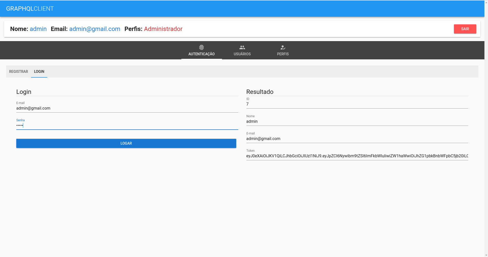
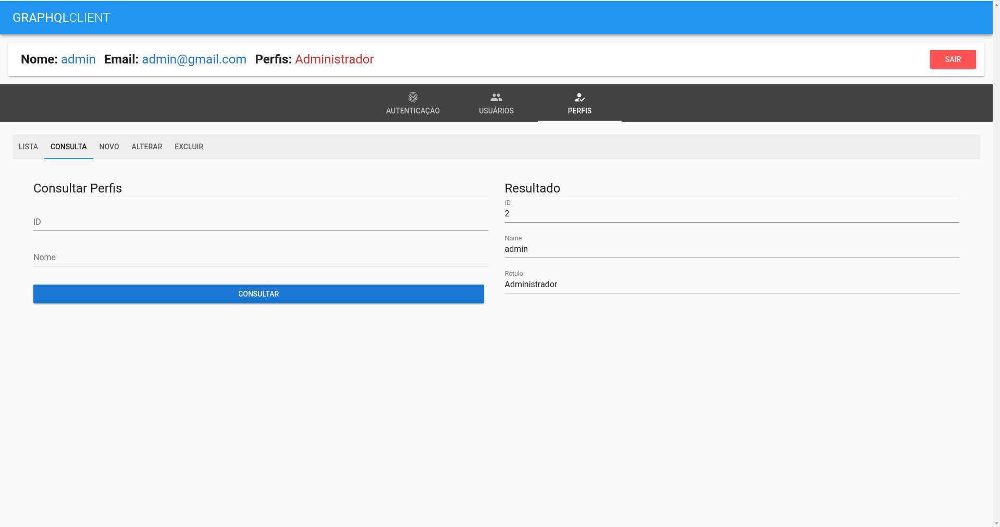

This repository is designed to study the GraphQL technology

# Projeto 01
This is the simpler version of the code, where I learned the basics of the GraphQL syntax and its stack (Apollo and GraphQL itself, mainly)
It contains challenges which leads me to understand what are the "resolvers" and the "schema"(or "typedefs")
Everything is in-memory.

# Projeto 02
This version teaches me a folder structure suggestion.
It contains also the main entities being manipulated for the other projects
Learned about the "Mutation" and how to manipulate the request for the GraphQL
in cases such as "add Profile", and how to pass parameter to the "Query" commands
It also contains the Schema and what they represent in GraphQL.
Everything is still in-memory.

# Projeto 03
This version is essentially the same as the previous, but now the data is persistent and manipulated by knex package
Also developed some Docker code for the database
# Projeto 04
This version is an End-2-End solution, with GraphQL/Knex in back end and Vue for the FrontEnd.
It includes much more interesting technologies, such as JWT/Authentication and Context (both in GraphQL)
All request now are being handled by the Vue side.
Below, some screenshot examples of platform

